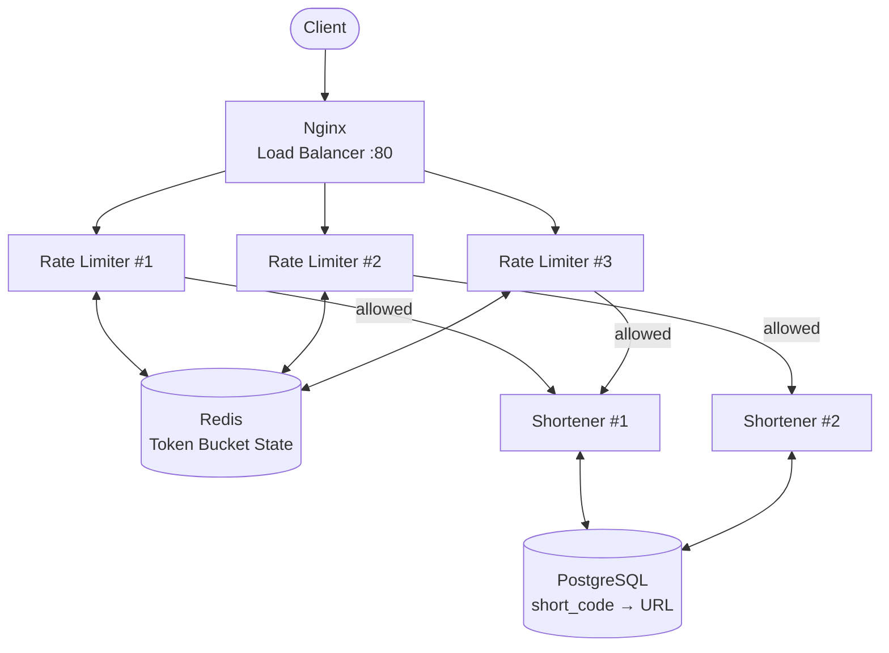

# 🔗 Distributed URL Shortener & Rate Limiter

A URL shortener built as two independent microservices — a rate-limiting gateway in front of a shortening service — designed around a real system-design question: **how do you enforce a limit correctly across multiple servers, and stay predictable when the thing enforcing it fails?**

[](https://www.python.org/)
[](https://fastapi.tiangolo.com/)
[](https://redis.io/)
[](https://www.postgresql.org/)
[](https://www.docker.com/)
[](.github/workflows/ci.yml)
[](LICENSE)

---

## Why this project exists

Most portfolio projects are CRUD apps. This one isn't — it's built around four questions that show up in real distributed-systems interviews:

- How do two independent services agree on shared state without stepping on each other?
- How do you stop a race condition when multiple requests hit the same counter at the same instant?
- What happens when your rate limiter's own dependency (Redis) dies — do you fail open or fail closed?
- How do you actually scale this horizontally, not just claim you could?

## Architecture



Only Nginx is exposed to the outside world. Postgres, Redis, and both services are reachable only inside Docker's internal network — nothing internal is directly addressable from outside.

## The interesting part: atomic rate limiting

The rate limiter uses a **token bucket** algorithm, but the core logic runs entirely inside a single **Redis Lua script**, not as separate application-level calls.

```lua
-- Read, refill, check, and deduct — all in one atomic round trip
local bucket = redis.call("HMGET", key, "tokens", "last_refill")
-- ...refill math based on elapsed time...
if tokens >= requested then
    tokens = tokens - requested
    allowed = 1
end
redis.call("HMSET", key, "tokens", tokens, "last_refill", now)
```

**Why it has to be atomic:** if "check tokens" and "deduct tokens" were two separate Redis calls, two requests arriving at the same instant — on two different rate-limiter replicas — could both read the same token count and both get approved, silently exceeding the limit. Redis runs a Lua script as one uninterruptible unit, so that race condition can't happen. One round trip instead of three, and it's correct under real concurrency, not just in theory.

## Fault tolerance: fail open vs. fail closed

If Redis goes down, the rate limiter has to make a choice — and the code makes that choice a one-line config flag rather than a hardcoded assumption:

| Mode | Behavior | When you'd choose it |
|---|---|---|
| **Fail open** (default) | Let requests through unrestricted | Most consumer APIs — an outage costs more than a few minutes of unmetered traffic |
| **Fail closed** | Reject everything | Protecting something where unlimited traffic is worse than downtime — e.g. a metered paid API, a login endpoint |

```bash
# Simulate the failure and watch it live
docker compose stop redis
curl -i http://localhost/shorten -X POST -H "Content-Type: application/json" -d '{"url":"https://example.com"}'
# Fails OPEN (200) or CLOSED (429) depending on the FAIL_OPEN env var — no code change needed
```

## Tech stack

| Layer | Choice |
|---|---|
| API framework | FastAPI (async, auto-generated OpenAPI docs) |
| Rate-limit store | Redis, with Lua scripting for atomicity |
| Database | PostgreSQL, run as a plain container (not a managed service — zero cloud DB cost) |
| Load balancer | Nginx, reverse-proxying to multiple replicas of each service |
| Orchestration | Docker Compose locally; AWS EC2 free tier in the cloud |
| CI/CD | GitHub Actions — lint → test → build → Trivy security scan on every push |

## Getting started

```bash
git clone https://github.com/priyanshuuuuu/distributed-url-shortener.git
cd distributed-url-shortener
docker compose up --build --scale shortener-service=2 --scale rate-limiter-service=3
```

### Shorten a URL

```bash
curl -X POST http://localhost/shorten \
  -H "Content-Type: application/json" \
  -d '{"url": "https://example.com"}'
```

```json
{"short_code": "aB3xY9z", "short_url": "http://localhost/aB3xY9z", "long_url": "https://example.com/"}
```

### Use it

```bash
curl -iL http://localhost/aB3xY9z
```

## Project structure

```
distributed-url-shortener/
├── shortener-service/     # FastAPI + PostgreSQL — creates and resolves short links
├── rate-limiter-service/  # FastAPI + Redis — token bucket gateway in front of the shortener
├── nginx/                 # Reverse proxy / load balancer config
├── docker-compose.yml     # Wires everything together
└── .github/workflows/     # CI pipeline: lint, test, build, security scan
```

## What's next

- [ ] Per-API-key rate limits instead of per-IP
- [ ] Sliding-window log algorithm as an alternative, with a written trade-off comparison
- [ ] Prometheus + Grafana for live request/latency dashboards
- [ ] Link expiration

## Author

**Priyanshu Rohilla** — M.Sc. Cybersecurity, University of Birmingham
[GitHub](https://github.com/priyanshuuuuu) · [LinkedIn](https://linkedin.com/in/priyanshu-rohillaa)
